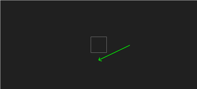
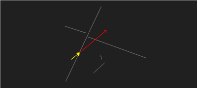

# collision-2d

There are many javascript collision routines and libraries for 2d. None satisifed all of these criteria:

* consistent API interface
* doesn't generate memory garbage
* consistent vector/matrix/line representation
* is data-oriented
* is purely functional
* collisions only - no gravity, rigid body handling, or complex solvers
* pure es modules

so here we are!


Note: If you're looking for higher-level 2d collision handling routine for ellipsoids vs line segments, check out https://github.com/mreinstein/collide-and-slide-2d


## available collision checks


### aabb-aabb overlap


```javascript
const collided = aabbAABBOverlap(aabb, aabb2, contact)
```


### aabb-aabb sweep 1


```javascript
const collided = aabbAABBSweep1(aabb, aabb2, delta, contact)
```


### aabb-aabb sweep 2


```javascript
const collided = aabbAABBSweep2(aabb, delta, aabb2, delta2, contact)
```


### aabb-segment sweep


```javascript
const collided = aabbSegmentSweep(line, aabb, delta, contact)
```


### aabb-segments sweep-indexed


```javascript
const collided = aabbSegmentsSweep1Indexed(segments, indices, segmentCount, aabb, delta, contact)
```

if there is a collision, `contact.collider` will be an integer indicating the index of which segment in the `segments` array collided.


### aabb-point overlap


```javascript
const collided = aabbPointOverlap(aabb, point, contact)
```


### aabb-segment overlap



```javascript
const collided = aabbSegmentOverlap(aabb, pos, delta, paddingX, paddingY, contact)
```


### ray-plane-distance


```javascript
import plane from 'plane.js'


const p = plane.create()
plane.fromPlane(p, planeOrigin, planeNormal)
const distance = plane.rayDistance(p, rayOrigin, rayVector)

```


### segment-normal

```javascript
const normal = segmentNormal(vec2.create(), pos1, pos2)
```


### segment-point-overlap


```javascript
const collided = segmentPointOverlap(p, segPoint0, segPoint1) // true or false
```


### segment-segment-overlap


```javascript
const intersectionPoint = vec2.create()
if (segmentSegmentOverlap(seg1Point1, seg1Point2, seg2Point1, seg2Point2, intersectionPoint)) {
    // if we get here, intersectionPoint is filled in with where the 2 segments overlap
}
```


### segments-segment-overlap



```javascript
const collided = segmentsSegmentOverlap(segments, start, delta, contact)
```

if there is a collision, `contact.collider` will be an integer indicating the index of which segment in the `segments` array collided.


### segments-segment-overlap-indexed

```javascript
const segs = [
    [ p0, p1 ],
    [ p2, p3 ],
    [ p4, p5 ]
]
const indices = [ 0, 2 ]  // indices into the segs array

const segmentCount = 2    // numer of indices to include. only run the segmentsSegment intersection tests on [ p0, p1 ] and [ p4, p5]

const collided = segmentsSegmentOverlapIndexed(segments, indices, segmentCount, start, delta, contact)
```

if there is a collision, `contact.collider` will be an integer indicating the index of which segment in the `segments` array collided.


### segments-sphere-sweep 1


```javascript
const collided = segmentsSphereSweep1(segments, position, radius, delta, contact)
```

if there is a collision, `contact.collider` will be an integer indicating the index of which segment in the `segments` array collided.


### segments-sphere-sweep-1-indexed

```javascript
const segs = [
    [ p0, p1 ],
    [ p2, p3 ],
    [ p4, p5 ]
]
const indices = [ 0, 2 ]  // indices into the segs array

const segmentCount = 2    // only run the segmentsSphereSweep tests on [ p0, p1 ] and [ p4, p5 ]

const collided = segmentsSphereSweep1(segments, indices, segmentCount, position, radius, delta, contact)
```

if there is a collision, `contact.collider` will be an integer indicating the index of which segment in the `segments` array collided.


### sphere-sphere-overlap


```javascript
const collided = sphereSphereOverlap(centerA, radiusA, centerB, radiusB) // collided is true or false
```


### tri-point-overlap


```javascript
const collided = triPointOverlap(v0, v1, v2, point) // collided is true or false
```


## entities

The collision routines all use these entity definitions


### point

a point is a 2d vector, which is represented as an array with 2 values:
```javascript

const position = [ 200, 150 ] // x: 200, y: 150

```

We use the fantastic `gl-matrix` `vec2` for representing these.


### aabb

an axially aligned bounding box
```javascript
const aabb = {
    position: [ 200, 100 ],  // center point of the AABB
    width: 50,
    height: 50
}
```

###  segment

a line segment consists of 2 `point`s
```javascript
const segment = [
    [ 0, 0 ],   // starting point of line
    [ 100, 0 ]  // ending point of line
]
```


### plane

a 2d plane

```javascript
{
    origin: vec2.create(),
    normal: vec2.create(),
    D: 0,
}
```


### contact

The data structure populated when a collision occurs

```javascript
{
    // for segments-segment-overlap and segments-sphere-sweep1 this is set to the index
    // in the array of line segments passed into the collision routine
    // for all other routines, collider is a reference to the colliding object itself
    collider : null,

    position : [ 0, 0 ], // the exact position of the collision
    delta    : [ 0, 0 ], // a vector that can be applied to get out of the colliding state
    normal   : [ 0, 0 ], // the collision normal vector
    time     : 0         // the time of the collision, from 0..1
}
```


## conventions

All collision checking functions return a boolean indicating if there was a collision. They also accept an optional `contact` argument, which gets filled in if there is an actual collision.


"sweep" tests indicate at least 1 of the objects is moving. the number indicates how many objects are moving. e.g., `aabb-aabb-sweep2` means we are comparing 2 aabbs, both of which are moving.

"overlap" tests don't take movement into account, and this is a static check to see if the 2 entities overlap.

plural forms imply a collection. e.g., `segments-segment-ovelap` checks one line segment against a set of line segments. If there is more than one collision, the closest collision is set in the `contact` argument.

"indexed" tests are the same as their non-indexed forms, except they take in an array of segment indices to use. These are nice in that you can avoid having to build large arrays of line segments every frame, if you have things like dynamic line segments (platforms) or have a spatial culling algorithm that selects line segments to include.


## credits

Most of these collision checks were adapted from existing open source modules:

* https://github.com/noonat/intersect
* The diagrams are modified from noonat: https://noonat.github.io/intersect/
* https://github.com/kevzettler/gl-swept-sphere-triangle
* https://gist.github.com/toji/2802287
* segment-point-overlap from https://gist.github.com/mattdesl/47412d930dcd8cd765c871a65532ffac
* segment-segment overlap from https://github.com/tmpvar/segseg
* http://www.gamasutra.com/view/feature/131790/simple_intersection_tests_for_games.php
* http://geomalgorithms.com/a07-_distance.html#dist3D_Segment_to_Segment
* https://observablehq.com/@kelleyvanevert/2d-point-in-triangle-test
* aabb-segment sweep from https://gamedev.stackexchange.com/questions/29479/swept-aabb-vs-line-segment-2d
